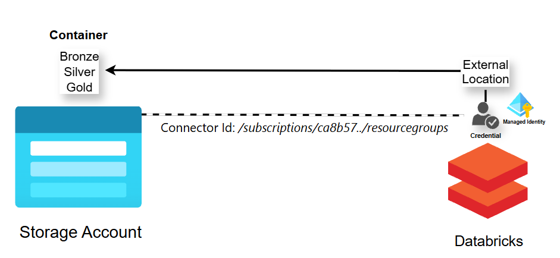

# Data Engineering Tutorial: From Raw Data to Azure Synapse Analytics

# Introduction

This guide walks you through creating a scalable data pipeline in Azure, transforming raw data into meaningful insights using Databricks, Azure Data Factory (ADF), and Synapse Analytics.

## Diagrams

## **What You’ll Learn**
  1. Configure Azure Databricks and securely access data in Azure Storage.
  2. Process and transform data using Databricks notebooks (`bronze`, `silver`, `gold`).
  3. Automate data pipelines with Azure Data Factory.
  4. Query and optimize data in Synapse Analytics for analytics and visualization.

## **Estimated Time to Complete**
 - 2–4 hours, depending on familiarity with Azure services.

## **Technologies Used**
 - Azure Databricks
 - Azure Data Factory
 - Azure Synapse Analytics
   
---

# Steps

## 1) Create Resource - Databricks
  - Resource Group: `rg-earthquake` (Create New)
  - Workspace name: `earthquake-db`
  - Region: `East US`
  - Click `Create`

## 2) Create Resource - Storage Account (ADLS Gen2)
  - Resource Group: `rg-earthquake`
  - Storage account name: `storeearthquake`
  - Region: `East US`
  - Primary service: `Azure Blob Storage or Azure Data Lake Storage Gen 2`
  - Redundancy: `Locally-redundant strage (LRS)` (Cheapest)
  - Click `Create`

  ### A) Create Storage Account Containers
   - **Data Storage** → **Containers**
   - Create 3 Containers (Bronze, Silver, Gold)

## 3) Create Resource - Synapse workspace
  - Resource Group: `rg-earthquake`
  - Workspace name: `earthquake-synapse`
  - Region: `East US`
  - Select Data Lake Storage Gen 2:
    - Account name: `storeearthquake`
    - File system name: `synapse-fs` (New)
    - [X] Assign myself the Storage Bloc Data Contributor on ADLS Gen2
  - Click `Create`

## 4) Databricks Deployment
  - Enter Databricks workspace `earthquake-db`
  - What each Tab does:
    - `Workspace`: Store/Create Notebooks
    - `Catalog`:   Connect ADLS storage to be maniupulate
    - `Compute`:   Notebooks run here
  ### A) Create Compute instance
   - Click create
   - Policy: `Unrestricted` - `Single Node`
   - Access mode: `Single user`
   - Performance
     - [ ] Use Photon Acceleration (Not needed)
     - Node type: `General purpose` lowest (ie 14 GB Memory, 4 Cores)
     - [X] Terminate after 20 minutes
   - Click `Create compute`

## 5)
  ### Create a Credential
  - `Catalog` → `External Data` → `Credential` → `Create credential`
  - Credential type: `Azure Managed Identity`
  - 
