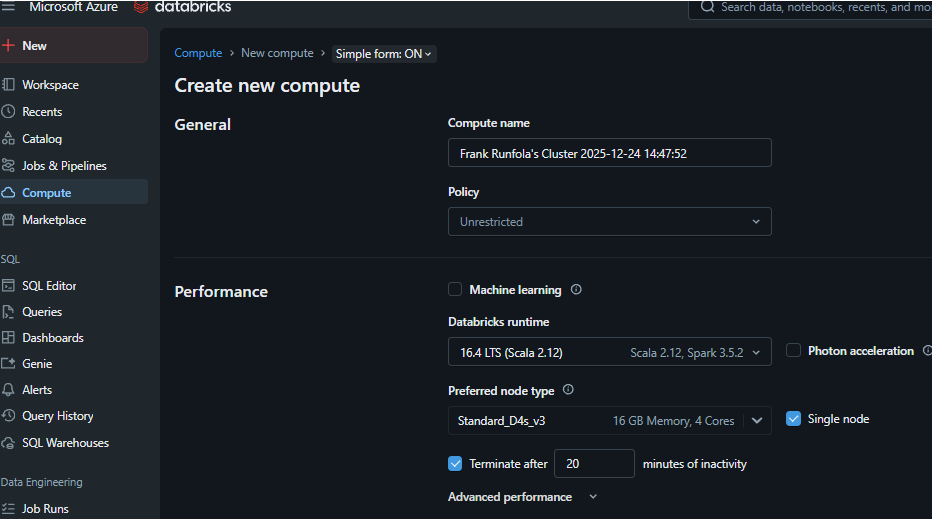

# Data Engineering Tutorial: From Raw Data to Azure Synapse Analytics

# Introduction

This guide walks you through creating a scalable data pipeline in Azure, transforming raw data into meaningful insights using Databricks, Azure Data Factory (ADF), and Synapse Analytics.

## **What You’ll Learn**
  1. Configure Azure Databricks and securely access data in Azure Storage.
  2. Process and transform data using Databricks notebooks (`bronze`, `silver`, `gold`).
  3. Automate data pipelines with Azure Data Factory.
  4. Query and optimize data in Synapse Analytics for analytics and visualization.

## **Technologies Used**
 - Azure Databricks
 - Azure Data Factory
 - Azure Synapse Analytics
---
<br/>

# Steps

## 1) Create Resource - Databricks
  - Resource Group: `rg-earthquake` (Create New)
  - Workspace name: `earthquake-db`
  - Region: `East US`
  - Click `Create`
<br/>

## 2) Create Resource - Storage Account (ADLS Gen2)
  - Resource Group: `rg-earthquake`
  - Storage account name: `storeearthquake`
  - Region: `East US`
  - Primary service: `Azure Blob Storage or Azure Data Lake Storage Gen 2`
  - Redundancy: `Locally-redundant strage (LRS)` (Cheapest)
  - Click `Create`

  ### Create Storage Account Containers
   - **Data Storage** → **Containers**
   - Create 3 Containers (Bronze, Silver, Gold)
<br/>

## 3) Create Resource - Synapse workspace
  - Resource Group: `rg-earthquake`
  - Workspace name: `earthquake-synapse`
  - Region: `East US`
  - Select Data Lake Storage Gen 2:
    - Account name: `storeearthquake`
    - File system name: `synapse-fs` (New)
    - [X] Assign myself the Storage Bloc Data Contributor on ADLS Gen2
  - Click `Create`
<br/>

## 4) Databricks Deployment
  - Launch Databricks workspace `earthquake-db`
  - What each Tab does:
    - `Workspace`: Store/Create Notebooks
    - `Catalog`:   Connect ADLS storage to be maniupulate
    - `Compute`:   Notebooks run here
   ### Create Compute instance
   1. Click create
   2. Policy: `Unrestricted` - `Single Node`
   3. Access mode: `Single user`
   4. Performance
     - [ ] Use Photon Acceleration (Not needed)
     - Node type: `General purpose` lowest (ie 14 GB Memory, 4 Cores)
     - [X] Terminate after 20 minutes
   5. Click `Create compute`
<br/>


<br/>
<br/>

## 5) Security Architecture
  
  <br/>
  <br/>

## 6) Setup Secure Connection for Databricks (ADLS -----> ADB)
  ### Create a Credential (to be used for an external location)
  1. `Catalog` → `External Data` → `Credential` → `Create credential`
  2. Credential type: `Azure Managed Identity`
  3. Credential name: `earthqual-cred`
  4. Access connector ID: `/subscriptions/ca8b577e-..accessConnectors/unity-catalog-access-connector` (**FOUND BELOW**)
     - Azure portal → `rg-earthquake`(resource group) → `earthquake-db` (db resource) → Managed Resource Group: `databricks-rg-earthquake-<unique>` → `unity-catalog-access-connector`
     - COPY Resource ID : `/subscriptions/ca8b577e-..accessConnectors/unity-catalog-access-connector`
  <br/>
  
  
  <br/>
  <br/>
  
  ### Create External Locations
  1. `Catalog` → `External Data` → `Create external location`
  2. Create 3 External Locations for all Medallion Stages
     1. Bronze
        1. External location name: `bronze`
        2. External location name: `abfss://bronze@storeearthquake.dfs.core.windows.net/` (**endpoint to ADLS container**)
        3. Storage Credential: `earthqual-cred` (from 5.3)
     2. Silver
        1. External location name: `silver`
        2. External location name: `abfss://silver@storeearthquake.dfs.core.windows.net/` (**endpoint to ADLS container**)
        3. Storage Credential: `earthqual-cred` (from 5.3)
     3. Gold
        1. External location name: `gold`
        2. External location name: `abfss://gold@storeearthquake.dfs.core.windows.net/` (**endpoint to ADLS container**)
        3. Storage Credential: `earthqual-cred` (from 5.3)
  <br/>
  
  
  <br/>
  <br/>


## 7) Setup Secure Connection for ADLS (ADLS <----- ADB)
  1. Azure portal → `storage accont` → `Access Control (IAM)` → `Role assignments` → `Add` 
  2. `Role` → Job function role: **Storage Blob Data Contributor**
  3. `Members` → Assigned access to: **Managed identity**
  4. On the right pane:
     - Managed identity: **Access Connector for Azure Databricks**
     - Select: **unity-catalog-access-connector**
  5. `Select` → `Review and Assign`
<br/>
<br/>

## 8) Set Up Databricks
1. Azure portal → Launch Databricks workspace `earthquake-db`
2.  Install python library to cluster
   - `Compute`  → click cluster  → `Libraries`  → `Install new` 
   - Library Source: `PyPi`
   - Package: `reverse_geocoder`
4. `Workspace` → `Create`
  - **bronze**: Raw data ingestion
  - **silver**: Data cleaning and transformation
  - **gold**: Aggregated and ready-to-query data

  ```python
#~~~~~~~~~~~~~~~~~~~~~~~~~~~~~~~~~~~~~~~~~~~~~~~~~~~~~~~~~~~~~~~~~~~~~~~~~~~~~
#                          bronze
#~~~~~~~~~~~~~~~~~~~~~~~~~~~~~~~~~~~~~~~~~~~~~~~~~~~~~~~~~~~~~~~~~~~~~~~~~~~~~
# Mount ADLS Gen2
# Required each time the cluster is restarted which should be only on the first notebook as they run in order
tiers = ["bronze", "silver", "gold"]
adls_paths = {tier: f"abfss://{tier}@storeearthquake.dfs.core.windows.net/" for tier in tiers}

# Accessing paths
bronze_adls = adls_paths["bronze"]
silver_adls = adls_paths["silver"]
gold_adls = adls_paths["gold"] 

dbutils.fs.ls(bronze_adls)
dbutils.fs.ls(silver_adls)
dbutils.fs.ls(gold_adls)

bronze_adls,silver_adls,gold_adls
#---------------------------------------------------------------------
##########################################################
#REMOVE before running Data Factory Pipeline
##########################################################
'''
start_date = date.today() - timedelta(1)
#end_date = date.today()
#start_date, end_date
'''

##########################################################
#ADD while running Data Factory Pipeline
##########################################################
#'''Get base parameters
dbutils.widgets.text("start_date", "")
dbutils.widgets.text("end_date", "")
start_date = dbutils.widgets.get("start_date")
end_date = dbutils.widgets.get("end_date")
#'''
#---------------------------------------------------------------------
import requests
import json
from datetime import date, timedelta

# Construct the API URL with start and end dates provided by Data Factory, formatted for geojson output.
url = f"https://earthquake.usgs.gov/fdsnws/event/1/query?format=geojson&starttime={start_date}&endtime={end_date}"

try:
    # Make the GET request to fetch data
    response = requests.get(url)

    # Check if the request was successful
    response.raise_for_status()  # Raise HTTPError for bad responses (4xx or 5xx)
    data = response.json().get('features', [])

    if not data:
        print("No data returned for the specified date range.")
    else:
        # Specify the ADLS path
        file_path = f"{bronze_adls}/{start_date}_earthquake_data.json"

        # Save the JSON data
        json_data = json.dumps(data, indent=4)
        dbutils.fs.put(file_path, json_data, overwrite=True)
        print(f"Data successfully saved to {file_path}")

except requests.exceptions.RequestException as e:
    print(f"Error fetching data from API: {e}")

#data[0]

#---------------------------------------------------------------------
#''' Data Factory
# Define your variables
output_data = {
    "start_date": start_date,
    "end_date": end_date,
    "bronze_adls": bronze_adls,
    "silver_adls": silver_adls,
    "gold_adls": gold_adls
}

# Serialize the dictionary to a JSON string
output_json = json.dumps(output_data)

# Log the serialized JSON for debugging
print(f"Serialized JSON: {output_json}")

# Return the JSON string
dbutils.notebook.exit(output_json)
#'''

#~~~~~~~~~~~~~~~~~~~~~~~~~~~~~~~~~~~~~~~~~~~~~~~~~~~~~~~~~~~~~~~~~~~~~~~~~~~~~
#                          silver
#~~~~~~~~~~~~~~~~~~~~~~~~~~~~~~~~~~~~~~~~~~~~~~~~~~~~~~~~~~~~~~~~~~~~~~~~~~~~~
##########################################################
#REMOVE before running Data Factory Pipeline
##########################################################
'''
from datetime import date, timedelta

# Remove this before running Data Factory Pipeline
start_date = date.today() - timedelta(1)

bronze_adls = "abfss://bronze@storeearthquake.dfs.core.windows.net/"
silver_adls = "abfss://silver@storeearthquake.dfs.core.windows.net/"
'''
#---------------------------------------------------------------------
##########################################################
#ADD while running Data Factory Pipeline
##########################################################
#''' Data Factory
import json

# Retrieve the bronze_params directly as a widget
bronze_params = dbutils.widgets.get("bronze_params")
print(f"Raw bronze_params: {bronze_params}")

# Parse the JSON string
output_data = json.loads(bronze_params)

# Access individual variables
start_date = output_data.get("start_date", "")
end_date = output_data.get("end_date", "")
bronze_adls = output_data.get("bronze_adls", "")
silver_adls = output_data.get("silver_adls", "")
gold_adls = output_data.get("gold_adls", "")

print(f"Start Date: {start_date}, Bronze ADLS: {bronze_adls}")
#'''
#---------------------------------------------------------------------
from pyspark.sql.functions import col, isnull, when
from pyspark.sql.types import TimestampType
from datetime import date, timedelta
#---------------------------------------------------------------------
# Load the JSON data into a Spark DataFrame
df = spark.read.option("multiline", "true").json(f"{bronze_adls}{start_date}_earthquake_data.json")
#---------------------------------------------------------------------
# Reshape earthquake data
df = df.select(
    "id",
    col("geometry.coordinates").getItem(0).alias("longitude"),
    col("geometry.coordinates").getItem(1).alias("latitude"),
    col("geometry.coordinates").getItem(2).alias("elevation"),
    col("properties.title").alias("title"),
    col("properties.place").alias("place_descr"),
    col("properties.sig").alias("sig"),
    col("properties.mag").alias("mag"),
    col("properties.magType").alias("magType"),
    col("properties.time").alias("time"),
    col("properties.updated").alias("updated"),
)
#---------------------------------------------------------------------
# Validate data: Check for missing or null values
df = (
    df
    .withColumn("longitude", when(isnull(col("longitude")), 0).otherwise(col("longitude")))
    .withColumn("latitude", when(isnull(col("latitude")), 0).otherwise(col("latitude")))
    .withColumn("time", when(isnull(col("time")), 0).otherwise(col("time")))
)
#---------------------------------------------------------------------
# Convert 'time' and 'updated' from long to timestamp from Unix time
df = (
    df
    .withColumn("time", (col("time") / 1000).cast(TimestampType()))
    .withColumn("updated", (col("updated") / 1000).cast(TimestampType()))
)
#---------------------------------------------------------------------
# Save the transformed DataFrame to the Silver container
silver_output_path = f"{silver_adls}earthquake_events_silver/"
silver_output_path
#---------------------------------------------------------------------
# Append DataFrame to Silver container in Parquet format
df.write.mode('append').parquet(silver_output_path)
#---------------------------------------------------------------------
##########################################################
#ADD while running Data Factory Pipeline
##########################################################
#''' Data Factory
dbutils.notebook.exit(silver_output_path)
# Supply ADF Base params: bronze_params=@string(activity('Bronze Notebook').output.runOutput)
#'''
#~~~~~~~~~~~~~~~~~~~~~~~~~~~~~~~~~~~~~~~~~~~~~~~~~~~~~~~~~~~~~~~~~~~~~~~~~~~~~
#                          gold
#~~~~~~~~~~~~~~~~~~~~~~~~~~~~~~~~~~~~~~~~~~~~~~~~~~~~~~~~~~~~~~~~~~~~~~~~~~~~~
#---------------------------------------------------------------------
##########################################################
#REMOVE before running Data Factory Pipeline
##########################################################
'''
from datetime import date, timedelta

# Remove this before running Data Factory Pipeline
start_date = date.today() - timedelta(1)

silver_adls = "abfss://silver@storeearthquake.dfs.core.windows.net/"
gold_adls = "abfss://gold@storeearthquake.dfs.core.windows.net/"
silver_data = f"{silver_adls}earthquake_events_silver/"

silver_data
'''
#---------------------------------------------------------------------
##########################################################
#ADD while running Data Factory Pipeline
##########################################################
#''' Data Factory
import json

# Retrieve the bronze_params directly as a widget
dbutils.widgets.text("bronze_params","")
dbutils.widgets.text("silver_params","")

bronze_params = dbutils.widgets.get("bronze_params")
silver_params = dbutils.widgets.get("silver_params")

#DEBUG Print raw input values
print(f"Raw bronze_params: {bronze_params}")
print(f"Raw silver_params: {silver_params}")

# Parse the JSON string
bronze_date = json.loads(bronze_params)

# Access individual variables
start_date = bronze_date.get("start_date", "")
end_date = bronze_date.get("end_date", "")
silver_adls = bronze_date.get("silver_adls", "")
gold_adls = bronze_date.get("gold_adls", "")
silver_data = silver_params

#Debug: print extracted values for verifiaction
print(f"Start Date: {start_date}, End Date:: {end_date}")
print(f"Silver ADLS Path: {silver_adls}, Gold ADLS Path: {gold_adls}")
#---------------------------------------------------------------------
from pyspark.sql.functions import when, col, udf
from pyspark.sql.types import StringType

# Ensure the below library is installed on your cluster udner libraries
import reverse_geocoder as rg
from datetime import date, timedelta
#---------------------------------------------------------------------
df = spark.read.parquet(silver_data).filter(col('time') > start_date)
#---------------------------------------------------------------------
df = df.limit(5) # added to speed up processings as during testing it was proving a bottleneck
# The problem is caused by the Python UDF (reverse_geocoder) being a bottleneck due to its non-parallel nature and high computational cost per task
#---------------------------------------------------------------------
def get_country_code(lat, lon):
    """
    Retrieve the country code for a given latitude and longitude.

    Parameters:
        lat (float or str): Latitude of the location.
        lon (float or str): Longitude of the location.

    Returns:
        str: Country code of the location, retrieved using the reverse geocoding API.

    Example:
        >>> get_country_details(48.8588443, 2.2943506)
        'FR'
    """
    try:
        coordinates = (float(lat), float(lon))
        result = rg.search(coordinates)[0].get("cc")
        print(f"Processed coordinates: {coordinates} -> {result}")
        return result
    except Exception as e:
        print(f"Error processing coordinates: {lat}, {lon} -> {str(e)}")
        return None
#---------------------------------------------------------------------
# registering the udfs so they can be used on spark dataframes
get_country_code_udf = udf(get_country_code, StringType())
#---------------------------------------------------------------------
get_country_code(48.8588443, 2.2943506)
#---------------------------------------------------------------------
# adding country_code and city attributes
df_with_location = df.withColumn(
    "country_code", get_country_code_udf(col("latitude"), col("longitude"))
)
#---------------------------------------------------------------------
# adding significance classification
df_with_location_sig_class = df_with_location.withColumn(
    "sig_class",
    when(col("sig") < 100, "Low")
    .when((col("sig") >= 100) & (col("sig") < 500), "Moderate")
    .otherwise("High"),
)
#---------------------------------------------------------------------
# Save the transformed DataFrame to the Silver container
gold_output_path = f"{gold_adls}earthquake_events_gold/"
#---------------------------------------------------------------------
# Append DataFrame to Silver container in Parquet format
df_with_location_sig_class.write.mode('append').parquet(gold_output_path)

```
<br/>
<br/>

## 9) Run and Verify new files in Data Storage Container
 1. Azure portal → `storage accont` → `Data storage` → `Containers` → `gold` → `earthquake_events_gold`
 2. New parquee file created **part-00000-tid-8139..**
<br/>
<br/>

## 10)
<br/>
<br/>


