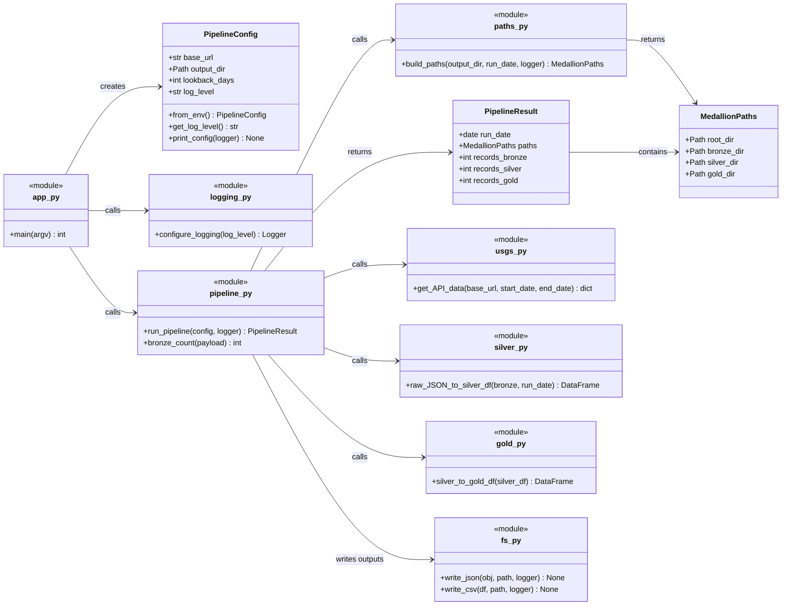

# Earthquake Pipeline (USGS) — Medallion Demo

## Introduction
This guide walks you through creating a scalable data pipeline in Azure, transforming raw data into meaningful insights using Databricks, Azure Data Factory (ADF), and Synapse Analytics.
<br/>

## **What You’ll Learn**
  1. Configure Azure Databricks and securely access data in Azure Storage.
  2. Process and transform data using Databricks notebooks (`bronze`, `silver`, `gold`).
  3. Automate data pipelines with Azure Data Factory.
  4. Query and optimize data in Synapse Analytics for analytics and visualization.
<br/>

## Business Case
Earthquake data is incredibly valuable for understanding seismic events and mitigating risks. Government agencies, research institutions, and insurance companies rely on up-to-date information to plan emergency responses and assess risks. With this automated pipeline, we ensure these stakeholders get the latest data in a way that’s easy to understand and ready to use, saving time and improving decision-making.
<br/>


## Architecture Overview
This pipeline follows a modular architecture, integrating Azure’s powerful data engineering tools to ensure scalability, reliability, and efficiency. The architecture includes:

1. **Data Ingestion**: Azure Data Factory orchestrates the daily ingestion of earthquake data from the USGS Earthquake API.
2. **Data Processing**: Databricks processes raw data into structured formats (bronze, silver, gold tiers).
3. **Data Storage**: Azure Data Lake Storage serves as the backbone for storing and managing data at different stages.
4. **Data Analysis**: Synapse Analytics enables querying and aggregating data for reporting.
5. **Optional Visualization**: Power BI can be used to create interactive dashboards for stakeholders.
<br/>

## Data Modeling
We implement a **medallion architecture** to structure and organize data effectively:

1. **Extract** Raw data ingested directly from public USGS earthquake data (GeoJSON)
2. Write to **Bronze Layer**: Stored in JSON format 
    - Used for future reprocessing if needed.
3. Transform to **Silver Layer**: Cleaned and normalized data
    - Removing duplicates and handling missing values, ensuring it’s ready for analytics.
4. **Gold Layer**: Aggregated and enriched data tailored to specific business needs, such as adding in country codes.
    - CSV (country code + significance class)
<br/>

See: `docs/architecture.md`

## Repo layout
```
earthquake/
|
├─ README.md                          # You are here: setup + how to run
├─ pyproject.toml                     # Packaging + deps (recommended)
├─ .pre-commit-config.yaml
├─ .env.example                       # Example env vars (no secrets)
├─ .gitignore                         # Ignore venv, data outputs, cache, etc.
│
├─ scripts/
│  └─ main.py                         # Simple “one command” runner (calls earthquake.app.main)
│
├─ src/
│  └─ earthquake/                     # Main Python package (importable)
│     ├─ __init__.py                  # Marks this folder as a package
│     ├─ app.py                       # Minimal entrypoint (loads env, builds config, runs pipeline)
│     ├─ pipeline.py                  # Orchestrates Bronze → Silver → Gold
│     ├─ config.py                    # Reads env vars and provides PipelineConfig
│     │
│     ├─ extract/                     # Getting raw data (Bronze)
│     │  └─ usgs.py                   # get_API_data() hits USGS API and returns GeoJSON
│     │
│     ├─ transform/                   # Cleaning/flattening (Silver)
│     │  └─ silver.py                 # raw_JSON_to_silver_df() → normalized dataframe
│     │
│     ├─ enrich/                      # Aggregations/analytics (Gold)
│     │  └─ gold.py                   # silver_to_gold_df() → daily rollups
│     │
│     ├─ io/                          # Read/write + path rules
│     │  ├─ fs.py                     # write_json(), write_csv()
│     │  └─ paths.py                  # build_paths() + MedallionPaths (bronze/silver/gold dirs)
│     │
│     └─ logging_utils.py             # configure_logging() helper (keep it tiny)
│
├─ tests/                             # Optional but smart: fast unit tests
│  ├─ test_paths.py                   # Ensures build_paths() outputs correct directories
│  ├─ test_silver_transform.py        # Ensures GeoJSON → dataframe shape/columns
│  └─ test_gold_rollup.py             # Ensures rollups are correct
│
|
└─ data/                              # GENERATED OUTPUT (gitignored)
   ├─ bronze/
   │  └─ run_date=YYYY-MM-DD/
   │     └─ usgs_features.json        # Raw API response snapshot
   |
   ├─ silver/
   │  └─ run_date=YYYY-MM-DD/
   │     └─ earthquakes_silver.csv    # Cleaned/flattened events
   |
   └─ gold/
      └─ run_date=YYYY-MM-DD/
         └─ earthquakes_gold.csv      # Daily metrics (counts, max/avg magnitude, etc.)
```
<br/>

## Understanding the API
- The earthquake API provides detailed seismic event data for a specified start and end date.
- **Start Date**: Defines the range of data. This is dynamically set via Azure Data Factory for daily ingestion.
- **API URL**: `https://earthquake.usgs.gov/fdsnws/event/1/`
<br/>

## Key Benefits
- **Automation**: Eliminates manual data fetching and processing, reducing operational overhead.
- **Scalability**: Handles large volumes of data seamlessly using Azure services.
- **Actionable Insights**: Provides stakeholders with ready-to-use data for informed decision-making.
<br/>


## Run Locally
```bash
python -m venv .venv                 # Create venv
source .venv/Scripts/activate        # Activate venv (PWSH: .\.venv\Scripts\Activate.ps1) (bash/zsh: source .venv/bin/activate)
python -m pip install --upgrade pip  # Upgrade pip
pip install -e .                     # Install project deps into venv
cp .env.example .env                 # Optional: load env vars (API_BASE_URL, OUTPUT_DIR)

# Code quality (recommended before running / before pushing)
pip install -U ruff                  # Install linter/formatter
ruff format .                        # Format code
ruff check . --fix                   # Lint + auto-fix safe issues
ruff format --check . && ruff check .  # CI-style check (no changes)

python -m earthquake                 # Run (defaults to yesterday->today) --log-level INFO
```

Outputs land in `data/bronze`, `data/silver`, `data/gold`.

## Configuration
Environment variables (via `.env`):
- `API_BASE_URL` (default: USGS endpoint)
- `OUTPUT_DIR` (default: `data`)
- `LOOKBACK_DAYS` (default: `1`)

## Linting (Ruff)

Ruff is used for formatting + linting.

```bash
# Format
ruff format src tests

# Lint (auto-fix safe issues)
ruff check src tests --fix

# CI-style check (no changes allowed)
ruff format --check src tests && ruff check src tests
```

## Run in Azure
For complete setup, view: `docs/architecture/azure.md`


